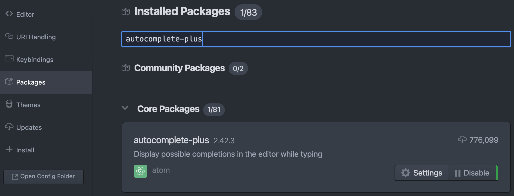
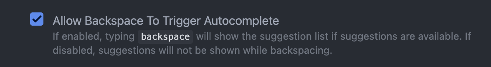
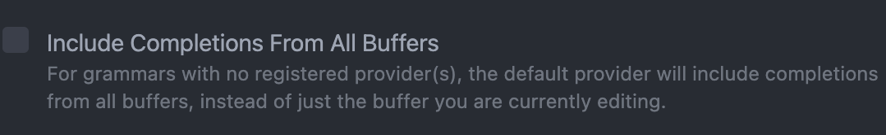
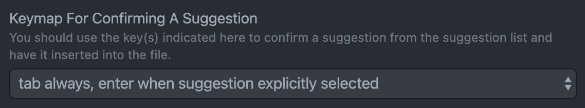

# CodeAssist

### Installation Instructions

 - Please register with your email to get beta access. https://codeassist.ai 

 - Search for autocomplete-plus &rarr; Settings

  

 - Make sure the following settings Apply

   - Enable completion on backspace

    

   - Disable the following (In-Buffer for completions)

    

   - Select Tab Always, Enter when suggestion explicitly selected

    

 - Search for bracket-matcher package (if installed) &rarr; Settings &rarr; and disable the following

  

 - Search for autocomplete-snippets package and disable it if enabled

 - Go to Menu Bar &rarr; Packages &rarr; codeassist-atom &rarr; Email Config and Input the email you used to register

  

 - (For WINDOWS only) Click CRLF in the bottom bar and change it to LF

  

 - Awesome! You are all set to start using it.

### Usage Instructions
 - To select the first completion press Tab. To select other completions press Up Key or Down key and Press Tab/Enter
 - To trigger completion for next line (Experimental), go to the new line and press ctrl+space

### Support for Jupyter Notebook
 - Hydrogen allows to run Jupyter notebooks inside atom.
   Download Hydrogen from https://atom.io/packages/hydrogen

---
Starter Code taken from https://github.com/Qusic/atom-youcompleteme
